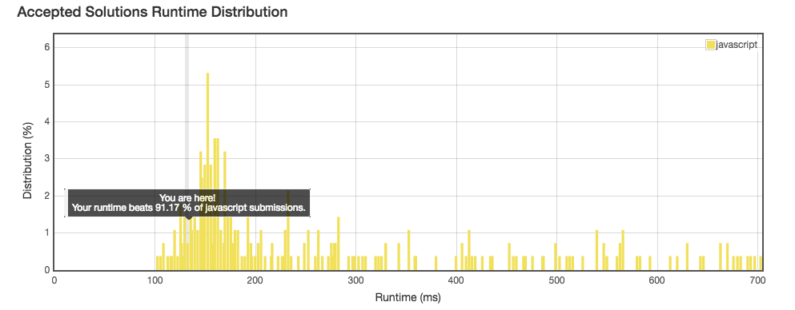

No. :
================
## Description
* Given two strings `s` and `t` which consist of only lowercase letters.
String `t` is generated by random shuffling string `s` and then add one more letter at a random position.
Find the letter that was added in `t`.
* URL: [Click me](https://leetcode.com/problems/find-the-difference/#/description)
* Difficulty: <font color="#90EE90">Easy</font> <!-- Green:#90EE90 Red:#FF0000 Orange: #FF7F00 -->
> Example:
```
Input:
s = "abcd"
t = "abcde"

Output:
e

Explanation:
'e' is the letter that was added.
```
-------------
## My solution
```javascript
/**
 * @param {string} s
 * @param {string} t
 * @return {character}
 */
var findTheDifference = function(s, t) {
    let hash = [];
    for(let i = 0; i < 26; i++) {
        hash[i] = 0;
    }
    for(let i = 0; i < s.length; i++) {
        hash[s.charAt(i).charCodeAt() - "a".charCodeAt()]++;
    }
    for(let i = 0; i < t.length; i++) {
        hash[t.charAt(i).charCodeAt() - "a".charCodeAt()]--;
    }
    for(let i = 0; i < hash.length; i++) {
        if(hash[i] === -1) {
            return String.fromCharCode(i+"a".charCodeAt());
        }
    }
    return "";
};
```

-------------
## Delightful version
```javascript
/**
 * @param {string} s
 * @param {string} t
 * @return {character}
 */
var findTheDifference = function(s, t) {
  var n = 0;
  for(var i = 0; i < s.length; i++) {
    n ^= s.charCodeAt(i);
  }
  for(i = 0; i < t.length; i++) {
    n ^= t.charCodeAt(i);
  }
  return String.fromCharCode(n);
};
```
-------------
## Thinking
* Using `XOR` to deal with appearence time of chars is such a fu**ing brilliant method!
* Hash list is useful too, but is a little unnecessary for this problem.