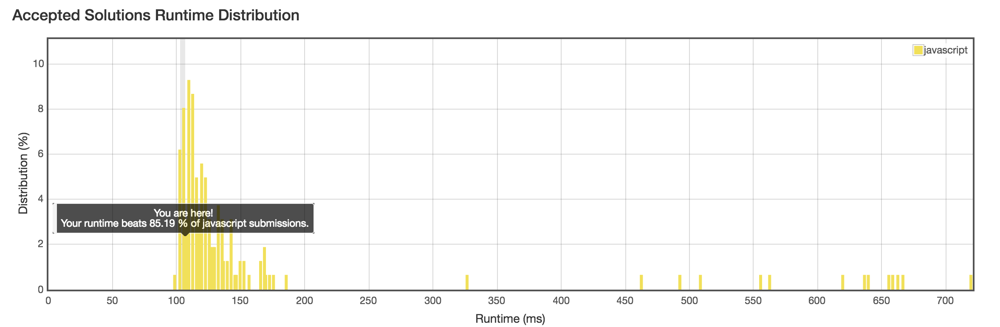

No. 11: Container With Most Water
================
## Description
* Given n non-negative integers a1, a2, ..., an, where each represents a point at coordinate (i, ai). n vertical lines are drawn such that the two endpoints of line i is at (i, ai) and (i, 0). Find two lines, which together with x-axis forms a container, such that the container contains the most water.

* URL: [Click me](https://leetcode.com/problems/container-with-most-water/#/description)
* Difficulty: <font color="#FF7F00">Medium</font> <!-- Green:#90EE90 Red:#FF0000 Orange: #FF7F00 -->

> Note: You may not slant the container and n is at least 2.
-------------
## My solution
```javascript
var maxArea = function(height) {
  var eHeight;
  var dis;
  var area;
  var maxarea = 0;
  for(let i = 0; i < height.length; i++){
    for(let j = i + 1; j < height.length; j++){
      eHeight = height[i] < height[j] ? height[i] : height[j];
      dis = j - i;
      area = eHeight * dis;
      maxarea = area > maxarea ? area : maxarea;
    }
  }
  return maxarea;
};
```
* Result: Time Limit Exceeded!
-------------
## Delightful version
### Ver.1 (No.1 version)
```javascript
var maxArea = function(height) {
    if (!height || height.length === 0) {
        return 0;
    }
    var i = 0;
    var j = height.length - 1;
    var area = 0;
    var max = 0;

    while(i < j) {
        if (height[i] < height[j]) {
            area = height[i] * (j - i);
            i++;
        } else {
            area = height[j] * (j - i);
            j--;
        }
        max = Math.max(area, max);
    }
    return max;
};
```
### Ver.2 (My script to the solution)
```javascript
var maxArea = function(height) {
  var len = height.length;
  var startPoint = 0;
  var endPoint = len - 1;
  var area;
  var maxarea = 0;
  var dis, eHeight;
  for(let i = 0; i < len - 1; i++) {
    dis = endPoint - startPoint;
    if(height[startPoint] < height[endPoint]) {
      eHeight = height[startPoint];
      startPoint++;
    } else {
      eHeight = height[endPoint];
      endPoint--;
    }
    area = dis * eHeight;
    maxarea = area > maxarea ? area : maxarea;
  }
  return maxarea;
};
```

-------------
## Thinking
* Force brute, say NO! The Time complexity: ​​$O(n^2)$
* Sort is not necessary in this problem (
* `Leetcode` recommands algorithm below:
> * The intuition behind this approach is that the area formed between the lines will always be limited by the height of the shorter line. Further, the farther the lines, the more will be the area obtained.
> *  We take two pointers, one at the beginning and one at the end of the array constituting the length of the lines. Futher, we maintain a variable $maxarea$ to store the maximum area obtained till now. At every step, we find out the area formed between them, update $maxarea$ and move the pointer pointing to the shorter line towards the other end by one step.
> * The time complexity of this algorithm: $O(n)$
