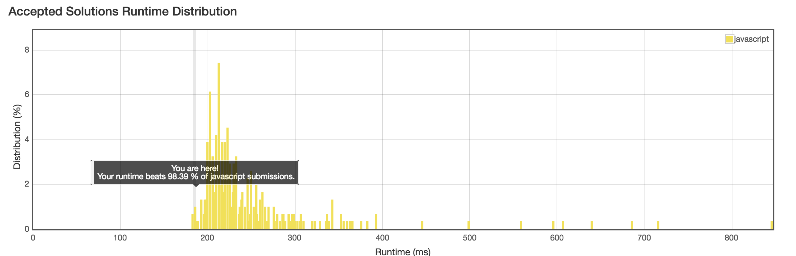

No.14 : Longest Common Prefix
================
## Description
* Write a function to find the longest common prefix string amongst an array of strings.
* URL: [Click me]()
* Difficulty: <font color="#90EE90">Easy </font> <!-- Green:#90EE90 Red:#FF0000 Orange: #FF7F00 -->

Some hints:
> The length of string array is `'1'` or `'0'` must be considered.
-------------
## My solution
```javascript
/**
 * @param {string[]} strs
 * @return {string}
 */
var longestCommonPrefix = function(strs) {
    var pref = strs[0];
    var i,j;
    for(i = 1; i < strs.length; i++) {
      for(j = 0; j < pref.length; j++) {
        if(strs[i][j] !== pref[j]) {
          pref = pref.slice(0,j);
          break;
        }
      }
      if(pref === '') {
          return pref;
      }
    }
    return pref;
};
```

-------------
## Another version
```javascript
/**
 * @param {string[]} strs
 * @return {string}
 */
var longestCommonPrefix = function(strs) {
  let prefix = '';
  let index = 0;
  let done = false;
  if (strs.length === 0) {
    return "";
  }
  if (strs.length === 1) {
    return strs[0];
  }
  while (!done) {
    let nextChar = null;
    for (let i = 0; i < strs.length; i++) {
      const current = strs[i];
      if (index === current.length) {
        done = true;
        break;
      } else if (nextChar === null) {
        nextChar = current[index];
      } else if (nextChar !== current[index]) {
        done = true;
        break;
      }
    }
    if (!done) {
      prefix = prefix + nextChar;
      index++;
    }
  }
  return prefix;
};
```
* Runtime no.1
-------------
## Thinking
* There are 2 ways to solve the problem:
> 1. Let prefix string equal one string in the array (the first commonly), and compare down below, we cut the string to short one until all strings are compared. And in this way the time comlexity is $O(m*n)$ (let's suppose the length of array is $n$ and the average length of strings is $m$). This is my algorithm.
> 2. We can regard the strings array as a list in vertical-looking. Let prefix string equal `''`, and then we add chars to prefix, which appears in
every string's same index. When the char does not appears in any string, the loop ends, we can get the prefix. In this way, the time complexity is $O(n*m)$.
> 3. So the runtime depends on where to stop the loop. In other words, the difference between two algotithms is the way to process the `pref` string. After a period of thinking, I find out that prefix should be start in `""` not in a string. So method 1 is better ( .
