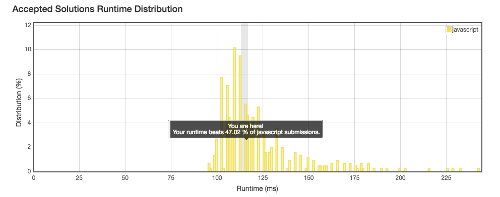

No. 20: Valid Parentheses
================
## Description
* Given a string containing just the characters `'('`, `')'`, `'{'`, `'}'`, `'['` and `']'`, determine if the input string is valid.
* URL: [Click me](https://leetcode.com/problems/valid-parentheses/#/description)
* Difficulty: <font color="#90EE90">Easy</font> <!-- Green:#90EE90 Red:#FF0000 Orange: #FF7F00 -->

Note:
> The brackets must close in the correct order, `"()"` and `"()[]{}"` are all valid but `"(]"` and `"([)]"` are not.
-------------
## My solution
```javascript
/**
 * @param {string} s
 * @return {boolean}
 */
var pre = {
    "{": "}",
    "(": ")",
    "[": "]"
};
var suf = {
    "}": "{",
    ")": "(",
    "]": "["
};
var isValid = function(s) {
    var parStack = [];
    var len = s.length;
    for(let i = 0; i < len; i++) {
        parStack.push(s[i]);
        // console.log("pushed: ", s[i]);
        if((s[i] in suf) && (parStack[parStack.length - 2] === suf[s[i]])) {
            // console.log("poped: ", parStack[parStack.length - 2], parStack[parStack.length - 1]);
            parStack.pop();
            parStack.pop();
        }
    }
    return parStack.length === 0;
};
```
;
-------------
## Delightful version
```javascript
/**
 * @param {string} s
 * @return {boolean}
 */
var isValid = function(s) {
    var myStack = [];
    var result = true;
    for (var i =0; i < s.length; i++) {
        var popped;
        switch(s[i]) {
            case '{':
                myStack.push(s[i]);
                break;
            case '[':
                myStack.push(s[i]);
                break;
            case '(':
                myStack.push(s[i]);
                break;
            case '}':
                popped = myStack.pop();
                if (popped !== '{') {
                    result = false;
                    return result;
                } 
                break;
            case ']':
                popped = myStack.pop();
                if (popped !== '[') {
                    result = false;
                    return result;
                } 
                break;
            case ')':
                popped = myStack.pop();
                if (popped !== '(') {
                    result = false;
                    return result;
                } 
                break; 
        }
    }
    if (myStack.length> 0) {
        result = false;
    } 
    return result;
}
```
-------------
## Thinking
* Although the No.1 runtime version gives No.1, my code is neater! 
* Algorithm is necessary, but cannot work without data_structure.