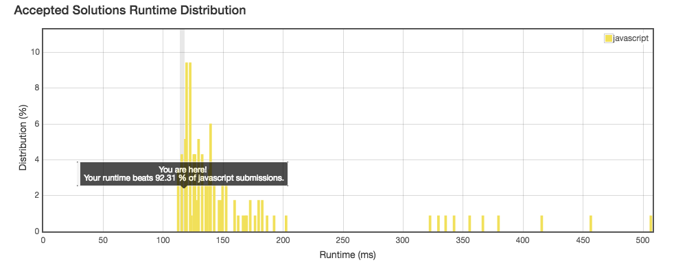

No.16: 3Sum Closest
================
## Description
* Given an array S of n integers, find three integers in S such that the sum is closest to a given number, target. Return the sum of the three integers. You may assume that each input would have exactly one solution.
```
For example, given array S = {-1 2 1 -4}, and target = 1.

The sum that is closest to the target is 2. (-1 + 2 + 1 = 2).
```
* URL: [Click me](https://leetcode.com/problems/3sum-closest/#/description)
* Difficulty: <font color="#FF7F00">Medium</font> <!-- Green:#90EE90 Red:#FF0000 Orange: #FF7F00 -->

-------------
## My solution
```javascript
/**
 * @param {number[]} nums
 * @param {number} target
 * @return {number}
 */
var threeSumClosest = function(nums, target) {
    let sortedArr = nums.sort( (a, b) => (a - b) );
    let minDiff = Infinity;
    let diff = 0;
    for(let i = 0; i < sortedArr.length - 2; i++) {
        for(let j = i + 1, k = sortedArr.length - 1; j < k; ) {
            diff = sortedArr[i] + sortedArr[j] + sortedArr[k] - target;
            if(diff === 0) {
                return target;
            } else {
                minDiff = Math.abs(diff) < Math.abs(minDiff) ? diff : minDiff;
                if(diff > 0) {
                    k--;
                } else {
                    j++;
                }
            }
        }
    }
    return minDiff + target;
};
```

