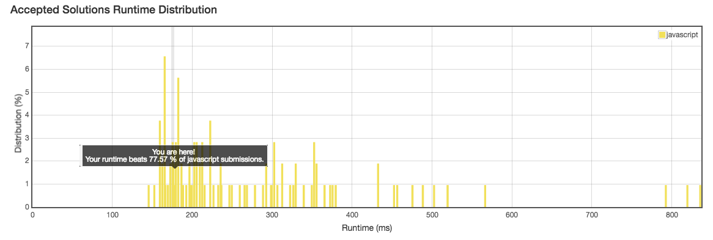

No.18: 4Sum
================
## Description
* Given an array S of n integers, are there elements a, b, c, and d in S such that a + b + c + d = target? Find all unique quadruplets in the array which gives the sum of target.
* URL: [Click me](https://leetcode.com/problems/4sum/#/description)
* Difficulty: <font color="#FF7F00">Medium</font> <!-- Green:#90EE90 Red:#FF0000 Orange: #FF7F00 -->

**Note:**
> The solution set must not contain duplicate quadruplets.
```
For example, given array S = [1, 0, -1, 0, -2, 2], and target = 0.

A solution set is:
[
  [-1,  0, 0, 1],
  [-2, -1, 1, 2],
  [-2,  0, 0, 2]
]
```
-------------
## My solution
```javascript
/**
 * @param {number[]} nums
 * @param {number} target
 * @return {number[][]}
 */
var fourSum = function(nums, target) {
    let sorted = nums.sort((a, b) => (a-b));
    // console.log(sorted);
    let len = sorted.length;
    var res = [];
    if(len <= 3) return res;
    let i = 0, j, k, l = len - 1;
    
    while(i <= len - 3) {
        // console.log("i:", i);
        if(i > 0 && (sorted[i] == sorted[i-1])) {
            i++;
            // console.log("i=i-1 continue");
            continue;
        }
        l = len - 1;
        while(l >= i + 3) {
            // console.log("l:", l);
            if(l < len - 1 && (sorted[l] == sorted[l+1])) {
                l--;
                // console.log("l=l+1 continue");
                continue;
            }
            j = i + 1;
            k = l - 1;
            while(j < k) {
                // console.log("j:", j, "k:", k);
                let dum = sorted[i] + sorted[j] + sorted[k] + sorted[l] - target;
                if(dum === 0) {
                    res.push([sorted[i], sorted[j], sorted[k], sorted[l]]);
                    // console.log("push: ",[sorted[i], sorted[j], sorted[k], sorted[l]]);
                    j++;
                    k--;
                    while(j < k && sorted[j] == sorted[j - 1]) {
                        j++;
                    }
                    while(j < k && sorted[k] == sorted[k + 1]) {
                        k--;
                    }
                } else if(dum < 0) {
                    j++;
                } else if(dum > 0) {
                    k--;
                }
            }
        l--;
        }
    i++;
    }
    return res;
};
```

-------------
## Delightful version
```javascript
/**
 * @param {number[]} nums
 * @param {number} target
 * @return {number[][]}
 */
var fourSum = function(nums, target) {
        var total = [];
    var n = nums.length;
    if (n < 4) return total;
    nums.sort((a, b) => {
        return a - b;
    });
    for (var i = 0; i < n - 3; i++) {
        if (i > 0 && nums[i] == nums[i - 1]) continue;
        if (nums[i] + nums[i + 1] + nums[i + 2] + nums[i + 3] > target) break; // large than target
        if (nums[i] + nums[n - 3] + nums[n - 2] + nums[n - 1] < target) continue; //small than target
        for (var j = i + 1; j < n - 2; j++) {
            if (j > i + 1 && nums[j] == nums[j - 1]) continue;
            if (nums[i] + nums[j] + nums[j + 1] + nums[j + 2] > target) break;
            if (nums[i] + nums[j] + nums[n - 2] + nums[n - 1] < target) continue;
            var left = j + 1, right = n - 1;
            while (left < right) {
                var sum = nums[left] + nums[right] + nums[i] + nums[j];
                if (sum < target) left++;
                else if (sum > target) right--;
                else {
                    total.push([nums[i],nums[j],nums[left],nums[right]]);
                    do {
                        left++;
                    } while (nums[left] == nums[left - 1] && left < right);
                    do {
                        right--;
                    } while (nums[right] == nums[right + 1] && left < right);
                }
            }
        }
    }
    return total;
};
```
-------------
## Thinking

optimation key:

```javascript
if (nums[i] + nums[j] + nums[j + 1] + nums[j + 2] > target) break;
if (nums[i] + nums[j] + nums[n - 2] + nums[n - 1] < target) continue;
```
