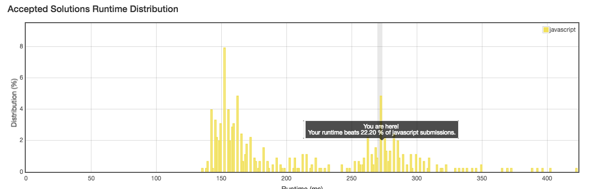

No. 26: Remove Duplicates from Sorted Array
================
## Description
* Given a sorted array, remove the duplicates in place such that each element appear only once and return the new length.

Do not allocate extra space for another array, you must do this in place with constant memory.

For example,
Given input array nums = `[1,1,2]`,

Your function should return length = `2`, with the first two elements of nums being `1` and `2` respectively. It doesn't matter what you leave beyond the new length.
* URL: [Click me](https://leetcode.com/problems/remove-duplicates-from-sorted-array/#/description)
* Difficulty: <font color="#90EE90">Easy</font> <!-- Green:#90EE90 Red:#FF0000 Orange: #FF7F00 -->
> F**king changing the proto array!
-------------
## My solution
```javascript
/**
 * @param {number[]} nums
 * @return {number}
 */
var removeDuplicates = function(nums) {
  if(nums.length < 2) {
    return nums.length;
  }
  else {
    var cur = nums[0];
    var last = nums[nums.length - 1];
    var i = 0;
    while(nums[i+1] !== undefined) {
      if(nums[i] === nums[i+1]) {
        nums.splice(i, 1);
      } else {
        i++;
      }
    }
    return nums.length;
  }
};
```

-------------
## Delightful version
```javascript
var removeDuplicates = function(nums) {
   if(nums === null || nums.length === 0) return 0;
    if(nums.length === 1) return 1;
    var count = 0;
    for(var i = 1 ; i < nums.length ; i++){
        if(nums[count] != nums[i]){
            nums[++count] = nums[i];
        }
    }    
    count = count + 1;
    return count;
};
```
-------------
## Thinking
* Opportunistic way to solve this problem. No algotithm.
* There's no instruction that says the proto array will be modified.
* A non-value problem which rate is poor (like:71 dislike: 261).