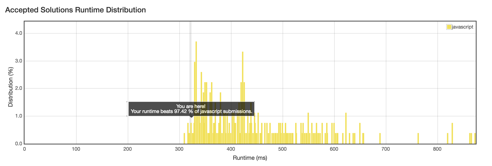

No.15 : 3Sum
================
## Description
* Given an array **S** of n integers, are there elements **a, b, c** in **S** such that **a + b + c = 0**? Find all unique triplets in the array which gives the sum of zero.
* URL: [Click me](https://leetcode.com/problems/3sum/#/description)
* Difficulty: <font color="#FF7F00">Medium</font> <!-- Green:#90EE90 Red:#FF0000 Orange: #FF7F00 -->

> Note: The solution set must not contain duplicate triplets.
```
For example, given array S = [-1, 0, 1, 2, -1, -4],

A solution set is:
[
  [-1, 0, 1],
  [-1, -1, 2]
]
```
-------------
## My solution (copy)
```javascript
/**
 * @param {number[]} nums
 * @return {number[][]}
 */
Array.prototype.qSort = function(){
  let len = this.length;
  if(len <= 1)
    return this;
  let pivot = [this[0]];
  let left = [];
  let right = [];
  for(let i = 1; i < len; i++){
    if(this[i] < pivot[0]){
      left.push(this[i]);
    }
    else{
      right.push(this[i]);
    }
  }
  return left.qSort().concat(pivot.concat(right.qSort()));
};

var threeSum = function(nums) {
    var len = nums.length;
    var res = [];
    if(len < 3) {
      return res;
    }
    nums = nums.qSort();
    for(var i = 0; i < len - 2; i++) {
      if(nums[i] > 0) {
        return res;
      }
      if(i > 0 && nums[i] === nums[i-1]) {
        continue;
      }
      for(var j = i + 1, k = len - 1; j < k;) {
        if(nums[i] + nums[j] + nums[k] === 0) {
          res.push([nums[i], nums[j], nums[k]]);
          j++;
          k--;
          while (j < k && nums[j] == nums[j - 1]) {
					  j++;
				  }
			  	while (j < k && nums[k] == nums[k + 1]) {
			  		k--;
			  	}
        } else if(nums[i] + nums[j] + nums[k] > 0) {
          k--;
        } else {
          j++;
        }
      }
    }
    return res;
};
```

-------------
## Thinking
* Sort the array is key to reduce the time complexity ($O(n^2)$)
* There is something strange in the Leetcode OJ: I give a prototype method `.qort()` to quick-sort the array, but runtime is more than the proto `.sort()` method.
* In common, we directly choose 2 numbers in the array and sum to `biSum`, than we search the remain elements in the array to sum `biSum` and each elements to judge whether `triSum` is 0.
