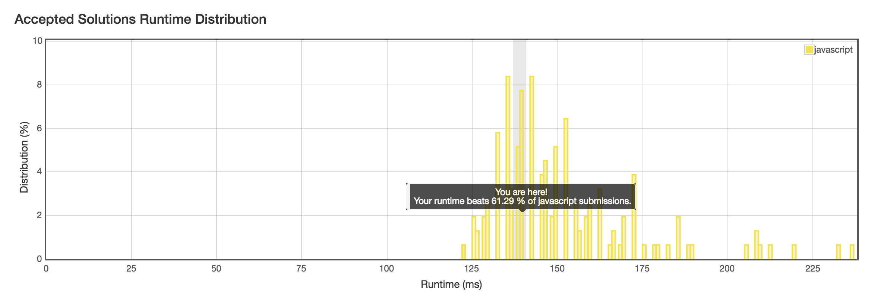

No. 19: Remove Nth Node From End of List
================
## Description
* Given a linked list, remove the *nth* node from the end of list and return its head.
* URL: [Click me](https://leetcode.com/problems/remove-nth-node-from-end-of-list/#/description)
* Difficulty: <font color="#FF7F00">Medium</font> <!-- Green:#90EE90 Red:#FF0000 Orange: #FF7F00 -->
* For example,
```
Given linked list: 1->2->3->4->5, and n = 2.
After removing the second node from the end, the linked list becomes 1->2->3->5.
```
Note:
> Given n will always be valid.
> Try to do this in one pass.
-------------
## My solution
```javascript
/**
 * Definition for singly-linked list.
 * function ListNode(val) {
 *     this.val = val;
 *     this.next = null;
 * }
 */
/**
 * @param {ListNode} head
 * @param {number} n
 * @return {ListNode}
 */
var removeNthFromEnd = function(head, n) {
    var cur = new ListNode(0);
    var dummy = new ListNode(0);
    dummy.next = head;
    cur = head;
    var len = 0;
    while(cur !== null) {
        len ++;
        cur = cur.next;
    }
    cur = dummy;
    len = len - n;
    while(len > 0) {
        len --;
        cur = cur.next;
    }
    cur.next = cur.next.next;
    return dummy.next;
};
```

-------------
## Delightful version
```javascript
var removeNthFromEnd = function(head, n) {
    const dummy = new ListNode(null);
    dummy.next = head;

    let leading = head;
    let prev = dummy;
    let curr = head;
    let i = 0;
    while (leading) {
        if (i >= n) {
            prev = prev.next;
            curr = curr.next;
        }
        leading = leading.next;
        i++;
    }
    prev.next = curr.next;
    return dummy.next;
};
```
-------------
## Thinking
1. `Head` points to first element, not traditonal linklist `head`!
2. dummy.next should be returned as head may be deleted!
3. The delightful version gives a perfect way to process `n` and `l - n`, but is not easy to understand.
4. The time complexity of two algorithms is $O(n)$, but 1st one cost $2l - n + 1$. 2nd one cost $l$.
