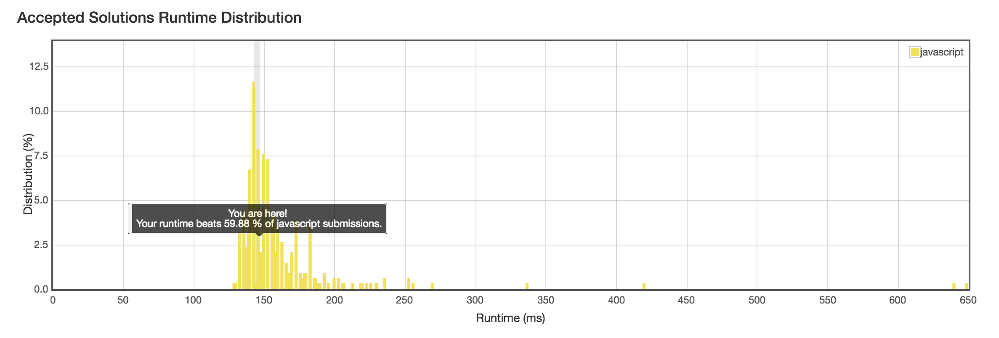

No. 21: Merge Two Sorted Lists
================
## Description
* Merge two sorted linked lists and return it as a new list. The new list should be made by splicing together the nodes of the first two lists.
* URL: [Click me](https://leetcode.com/problems/merge-two-sorted-lists/#/description)
* Difficulty: <font color="#90EE90">Easy </font> <!-- Green:#90EE90 Red:#FF0000 Orange: #FF7F00 -->
-------------
## My solution
```javascript
/**
 * Definition for singly-linked list.
 * function ListNode(val) {
 *     this.val = val;
 *     this.next = null;
 * }
 */
/**
 * @param {ListNode} l1
 * @param {ListNode} l2
 * @return {ListNode}
 */
var mergeTwoLists = function(l1, l2) {
    if(l1 === null) return l2;
    if(l2 === null) return l1;
    var head = new ListNode();
    head = l1.val < l2.val ? l1 : l2;
    var tmp = new ListNode();
    var other = new ListNode();
    other = l1.val >= l2.val ? l1 : l2;
    var cur = head;
    while(cur.next !== null && other !== null) {
        if(cur.next.val < other.val) {
            cur = cur.next;
        } else {
            tmp = cur.next;
            cur.next = other;
            cur = cur.next;
            other = tmp;

        }
    }
    if(cur.next === null) {
        cur.next = other;
    }
    return head;
};
```

-------------
## Delightful version
```javascript
var mergeTwoLists = function(l1, l2) {
  let dummy = new ListNode('');
  let p1 = l1;
  let p2 = l2;
  let curr = dummy;

  while (p1 && p2) {
    if (p1.val <= p2.val) {
      curr.next = p1;
      p1 = p1.next;
    } else {
      curr.next = p2
      p2 = p2.next;
    }
    curr = curr.next;
  }

  if (p1) {
    curr.next = p1;
  }
  if (p2) {
    curr.next = p2;
  }

  return dummy.next;
};
```
-------------
## Thinking
+ Code should be neat!
