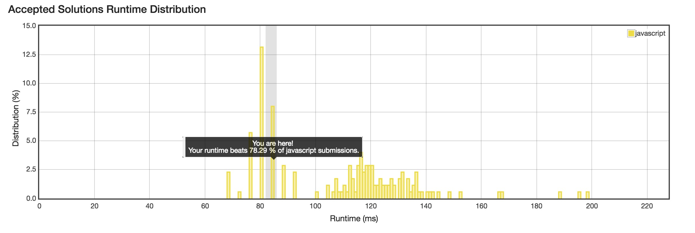

No. 236: Lowest Common Ancestor of a Binary Tree
================
## Description
* Given a binary tree, find the lowest common ancestor (LCA) of two given nodes in the tree.
* According to the [definition of LCA on Wikipedia](https://en.wikipedia.org/wiki/Lowest_common_ancestor): "The lowest common ancestor is defined between two nodes v and w as the lowest node in T that has both v and w as descendants (where we allow **a node to be a descendant of itself**)."
* URL: [Click me](https://leetcode.com/problems/lowest-common-ancestor-of-a-binary-tree/description/)
* Difficulty: <font color="#FF7F00">Medium </font> <!-- Green:#90EE90 Red:#FF0000 Orange: #FF7F00 -->

Some hints:
```
        _______3______
       /              \
    ___5__          ___1__
   /      \        /      \
   6      _2       0       8
         /  \
        7    4
```
-------------
## My solution
```javascript
/**
 * Definition for a binary tree node.
 * function TreeNode(val) {
 *     this.val = val;
 *     this.left = this.right = null;
 * }
 */
/**
 * @param {TreeNode} root
 * @param {TreeNode} p
 * @param {TreeNode} q
 * @return {TreeNode}
 */

const markParent = (head) => {
  if (!head) return;
  head.left && (head.left.parent = head);
  head.right && (head.right.parent = head);
  markParent(head.left);
  markParent(head.right);
};

const genAncestors = (node) => {
  node.ancestors = [node];
  let head = node;
  while (head.parent) {
    head = head.parent;
    node.ancestors.push(head);
  }
};

const listCommonAncestor = (p, q) => {
  let ret;
  p.ancestors.forEach(pa => {
    if (ret) return;
    q.ancestors.forEach(qa => {
      if (qa === pa) {
        ret = qa;
        return;
      };
    });
  })
  return ret;
};

var lowestCommonAncestor = function (root, p, q) {
  if (p === q) return p;
  markParent(root);
  genAncestors(p);
  genAncestors(q);
  // console.log(root);
  return listCommonAncestor(p, q);
};
```


-------------
## Delightful version
```javascript
/**
 * Definition for a binary tree node.
 * function TreeNode(val) {
 *     this.val = val;
 *     this.left = this.right = null;
 * }
 */
/**
 * @param {TreeNode} root
 * @param {TreeNode} p
 * @param {TreeNode} q
 * @return {TreeNode}
 */
var lowestCommonAncestor = function(root, p, q) {
  if (root === p || root === q || root === null)
      return root;
  else {
      const lcaLeft = lowestCommonAncestor(root.left, p, q);
      const lcaRight = lowestCommonAncestor(root.right, p, q);
      if (lcaLeft != null && lcaRight != null)
          return root;
      else
          return lcaLeft || lcaRight;
  }
};
```
-------------
## Thinking
- LAC
- Tarjan
- union-find sets

However, brute solution is also ok here.
